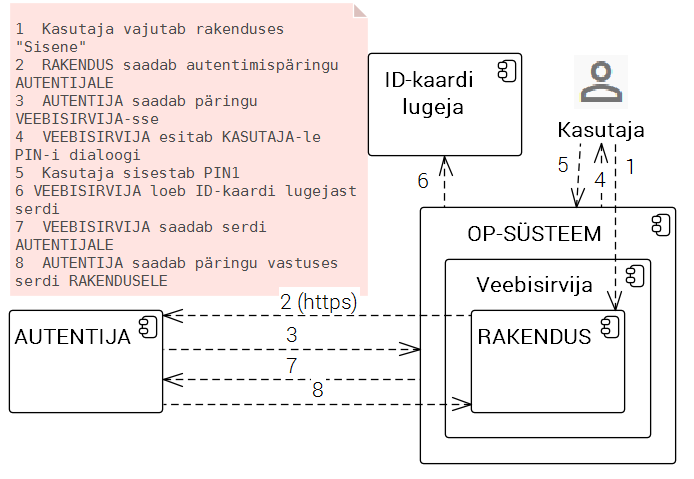

# Autentija

AUTENTIJA on lihtne, minimaalse keerukusega komponent, millel on üksainus funktsioon: kasutaja autentimine ID-kaardi abil.

NICE TO HAVE: Kui teeb ka mobiil-ID abil autentimist, on tore. Aga see pole tingimata vajalik.

Teostus ilmselt Java rakendusena (mis paigaldatakse veebiserverisse (Tomcat)).

Komponenti vajame vähemalt seniks, kuni käivitub eesti.ee eIDAS autentimisteenus.

Võimalik, et vajame ka eesti.ee eIDAS autentimisteenusest sõltumatult, selleks et RIHA eksperimentaalseid mooduleid katsetada.

