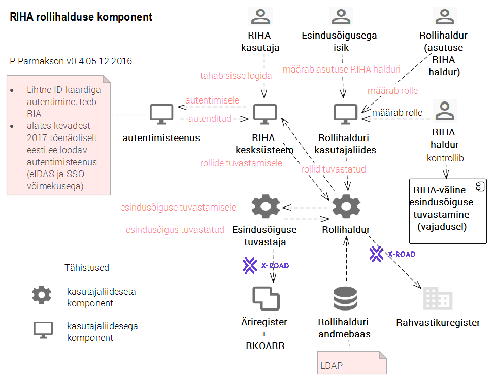

# RIHA rollihaldus. Tehniline lahendus

spetsifikatsioon

v0.3 - 05.12.2016

Sisukord

- [1 Ülevaade](#1-käsitlusala)
- [2 Mõisted ja lühendid](#2-mõisted-ja-lühendid)
- [3 Olulised viited](#3-olulised-viited)
- [4 Rollihalduse põhimõtted ja disaini eesmärgid](#4-rollihalduse-p%C3%B5him%C3%B5tted-ja-disaini-eesm%C3%A4rgid)
- [5 Lahendus](#5-lahendus)
- [6 Vajalikud tööd](#6-vajalikud-tööd)
- [Muutelugu](#muutelugu)

## 1 Käsitlusala

Pääsuhalduse korraldamine RIHA kesksüsteemis. Ei käsitleta pääsuhalduse korraldust lokaal-RIHAdes.

## 2 Mõisted ja lühendid

Lisaks alljärgnevatele on käesolevas dokumendis kasutusel dokumendis [2] defineeritud mõisted.

| mõiste | seletus |
|--------|---------|
| _RIHA kesksüsteem_ | RIA taristus käitatav, andmebaasist, REST API-st ja mitmetest kasutajaliidesega moodulitest RIHA hajuslahenduse keskne komponent |
| _lokaal-RIHA_ | RIHA kesksüsteemist eraldi paigutatud, asutuse enda kontrolli all olevad riigi infosüsteemi komponentide kirjeldused või kirjeldusi välja andvad API-d; neid API-sid realiseerivad tarkvararakendused; eraldi paigaldatud RIHA kirjeldusmoodul vm moodulid (kui neid peaks tulevikus tekkima) |

## 3 Olulised viited

[1] [RIHA üldvaade](https://github.com/e-gov/RIHA-API/blob/master/docs/YLDVAADE.md#riha-%C3%BCldvaade) - _ülevaade hajus-RIHA töösolevatest ja kavandatud komponentidest_

[2] [RIHA rollihaldus. Äriprotsess](Roles.md) - _spetsifikatsioon, määratleb äriprotsessi, mida käesolev tehniline lahendus teostab_

[3] Eesti.ee autentimisteenus v 0.9 (8.06.2016) - _2017.a kevadel valmiva teenuse spetsifikatsioon_

[4] [Autentija](Autentija.md) - _lihtne ID-kaardi põhine autentimisteenus_

[5] [RIHA MVP](https://e-gov.github.io/RIHA-API/MVP) - _ajakohasena hoitud ülevaade minimaalse keerukusega täistsüklilahendusest, RIHA tuumarendusest_

## 4 Põhimõtted ja disaini eesmärgid

RIHA rollihalduses on põhimõtteks:

- Ainult minimaalselt vajalik keerukus
  - keerukas rollihaldus on koormav ja kasutajad tegelikult ei vaja seda
  - vana RIHA rollihaldus on liiga keerukas
- Teha kõigepealt lihtne, aga töötav lahendus; tulevikus, kui tõesti vaja, alles siis täiendada.

## 5 Lahendus

Pääsuhalduslahendust üritati lahendada Eesti Tervise Sihtasutuse (ETSA) autentimis- ja autoriseerimislahenduse (AAM) kasutuselevõtmisega.  Üritus ei andnud loodetud tulemust. Järgnevalt on esitatud RIHA pääsuhalduse lahendus, mis tugineb omaarendatud komponentidele (joonis 1).

Joonis 1 

| komponent | detailiseering |
|----|----|
| autentimisteenus [4] | lihtne ID-kaardi põhine autentimisteenus; teenuse loob RIA; teenust kasutatakse kuni eesti.ee autentimisteenuse kasutuselevõtmiseni, vajadusel ka kauem |
| eesti.ee autentimisteenus [3] | pakub ka SSO-d; rahuldab RIHA kesksüsteemi vajadust korraldada kasutaja liikumine erinevate komponentide kasutajaliideste vahel ilma uuesti autentimise vajaduseta; valmimisajaks on kavandatud "kevad 2017" |
| Esindusõiguse tuvastaja | lihtne, ühtainust funktsiooni täitev komponent, mis on vajalik asutuse pääsuõiguste "puu" tekitamiseks. Pöördub üle X-tee Äriregistri (kuhu viiakse ka RKOARR) poole ja pärib teabe asutus(t)e kohta, keda isik esindab |
| Rollihaldur | komponent, mille funktsiooniks on RIHA kasutajate rollihaldus. Sisaldab andmebaasi ja kasutajaliidest. Tugineb RIHA rollide ja õiguste mudelile [2]. Rolle annavad ja võtavad ära _asutuse esindusõigusega isik_ ja _asutuse RIHA haldur_. Tehnoloogiaks OpenLDAP http://www.openldap.org/. Rollihaldus p.o lihtne, soovitavalt tuginema RBAC http://csrc.nist.gov/groups/SNS/rbac/ käsitlusele. Soovitatav on päring Rahvastikuregistrisse isikukoodi kontrolliseks. |
| "RIHA rollid ja õigused" | spetsifikatsioon |

## 6 Vajalikud tööd

|  töö | detailiseering  |
|---|---|
| Esindusõiguse tuvastaja teostamine | _sisaldab ka projekteerimist_ |
| Rollihalduri teostus | _sisaldab ka tehnoloogia kohandamist, analüüsi ja projekteerimist_ |

## Muutelugu

| versioon, kp | muudatus |
|------------|--------------------------------------------------------|
| v0.3 - 05.12.2016 | Mitmeid väiksemaid täiendusi |
